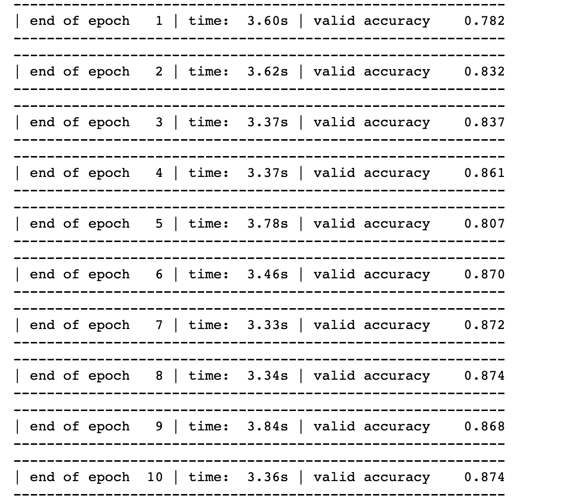
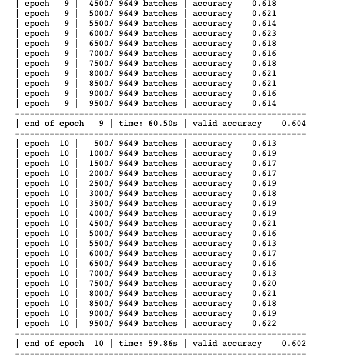

# Problem Statement
This assignment is to understand the use of torchtext API and its use in text classification. 
We have taken the two data sets for the purpose of the assigment and train our model such that the training accuracy is 50% more than the random prediction

1. [IMDB](https://pytorch.org/text/stable/datasets.html#imdb)

Number of classes=2

Number of training samples=25000

Number of test samples=25000

Random Prediction Accuracy= 50% 

Required accuracy= 50%+.5*50 >=75%

2. [Yelp Review Full]( https://pytorch.org/text/stable/datasets.html#yelpreviewfull)

Number of classes=5

Number of training samples=650000

Number of test samples=50000

Random Predictionn Accuracy=100/5=20%

Required Accuracy= 20%+.2*50 >=30%

## Results

1. On IMDB data : 
refer to the file [IMDB](https://github.com/TSAI-END3-Group/Session_5_TorchText/blob/master/dataset_IMDB.ipynb) 

__Training Accuracy:__
After 10 epochs accuracy is 87% which is greater than the required accuracy (75%)

__Training Logs:__

__Test Accuracy:__ 
86%

2. On YelpReviewFull Datat:
refer to the file [YelpReviewFull](https://github.com/TSAI-END3-Group/Session_5_TorchText/blob/master/dataset_YelpReviewFull.ipynb)

__Training Accuracy:__
After 10 epoch the training accuracy is 60% which is greater than the required accuracy (30%)

__Training Logs:__

__Test Accuracy:__
60%

## Contributors
* Rohit Agarwal
* Kushal Gandhi
* Vivek Kumar 
* Ammishaddai U
